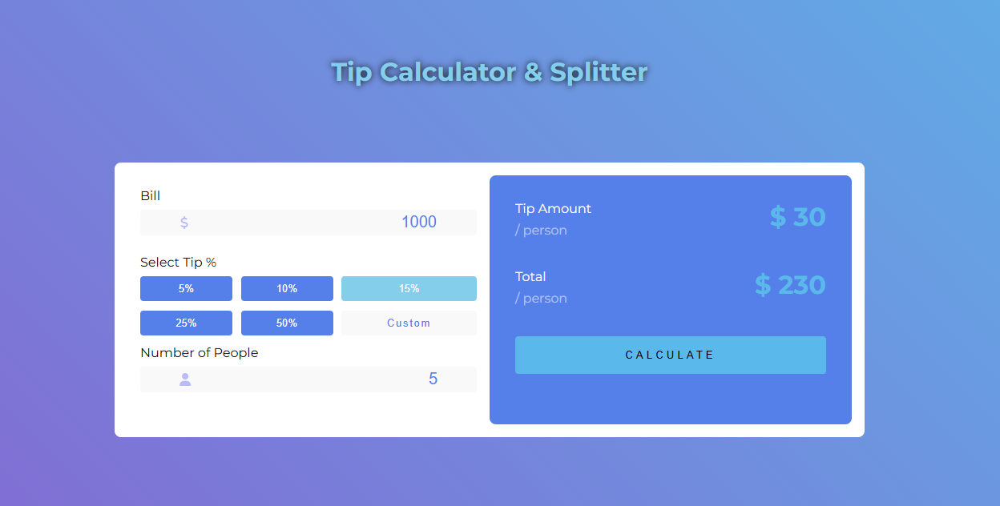

# 100 Days of JavaScript

Welcome to the **100 JavaScript Projects** repository! This repository is a collection of small JavaScript projects designed to help you learn and master JavaScript. Each project focuses on a different aspect of JavaScript and web development, from simple utilities to more complex applications.

## The Rules

- I will do 100 small JavaScript projects.
- There's no time limit on how long an individual exercise can take.
- Perfect is the enemy of good. I will not be afraid of making mistakes.
- I will ask for help when I need it.

## Projects

- **[Project 1: Tip Calculator](https://github.com/OneSideMoon/100-js-projects/tree/main/tip-calculator)**
     
    
    - **Description:** This Tip Calculator project allows users to input their total bill amount and select a tip percentage to calculate both the tip amount and the final total. It's a simple tool demonstrating basic HTML, CSS, and JavaScript functionality. [Source](https://www.youtube.com/watch?v=AOCGM82uVFk&list=PLs7ELP0wqJomtWYbW0N7NYC2VIMg_fAi_&index=1).
    - **Technologies Used:** HTML, CSS, JS
    - **Preview:** You can view the demo video [here](https://drive.google.com/file/d/1d0oPEbIReuW9dLzs6O-lHDPA2LRyKzlF/view?usp=drive_link).

## Contributing

I welcome feedback and contributions. If you have suggestions or fixes, please feel free to open a pull request or create an issue.

## Contact

If you have any questions or would like to get in touch with me, you can reach me through the following channels:
- [LinkedIn](https://www.linkedin.com/in/muhammet-batuhan-sahin-965b81216/)
- [Instagram](https://www.instagram.com/one.side.moon/)
- [Email](mailto:batuhansahin9040@gmail.com)

## License

This project is licensed under the [MIT License](https://github.com/OneSideMoon/frontend-mentor-challenge/blob/main/LICENSE).
